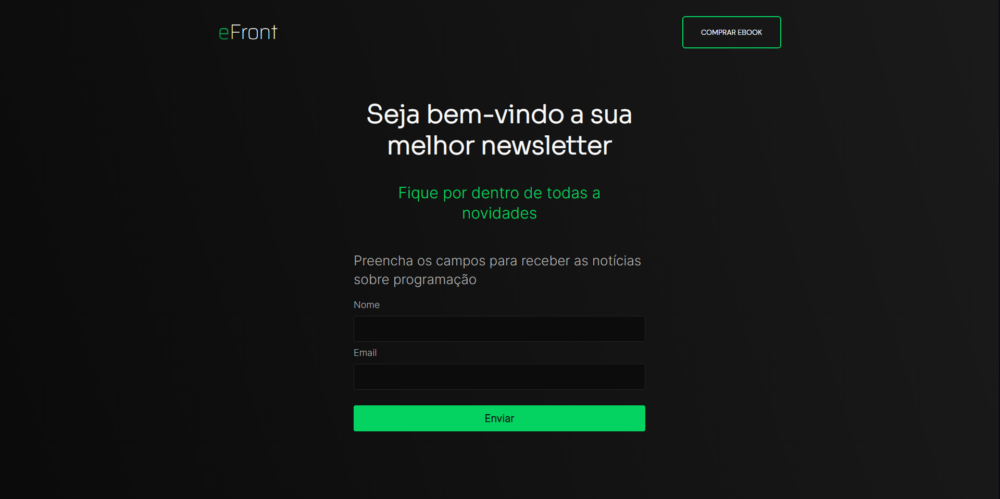

<h1 align="center">
  💻 Newslatter eFront
</h1>

---

<h4 align="center"><a href="https://devjoaogabriel.github.io/newsletter-efront/">Clique para visitar o projeto</a></h4>

---

## 💼 Tecnologias utilizadas

**Obs**: Os comportamentos em JavaScript que o exercicio pede serão adicionados em breve...

Utilizei apenas essas tecnologias com base em práticar meus conhecimentos:

-  HTML;
-  CSS;

---

> #### Exercicio do eBook "eFront" do Programador e UI Designer IuriCode!
>
> - <a href="https://hotmart.com/pt-br/marketplace/produtos/efront/L66686646K">Clique aqui</a> para acessar a pagina para comprar o eBook.
> - <a href="https://github.com/iuricode">Clique aqui</a> para acessar ao perfil do criador no GitHub.
>
---
